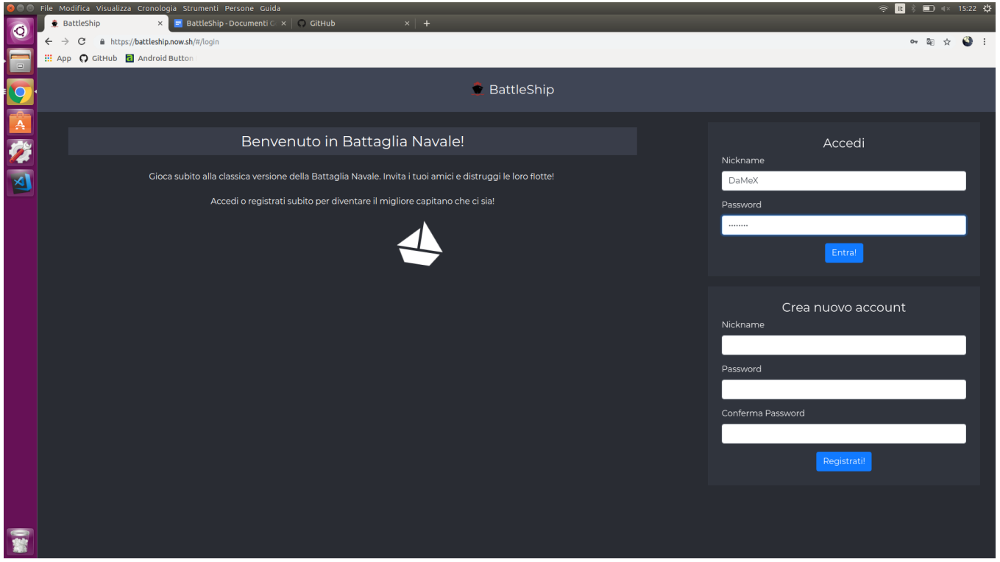
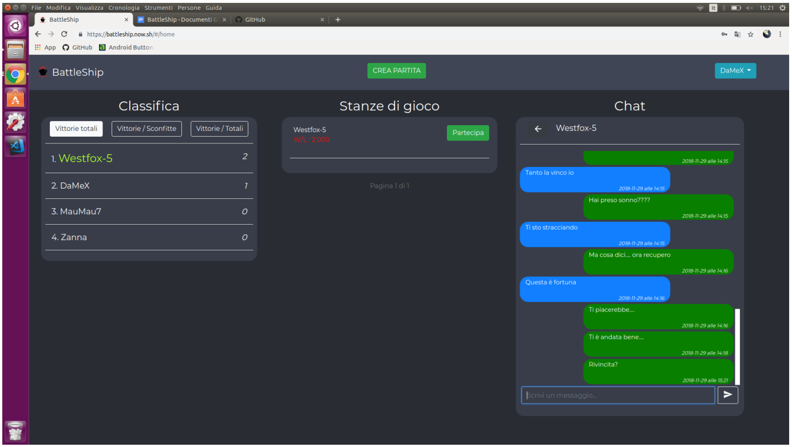
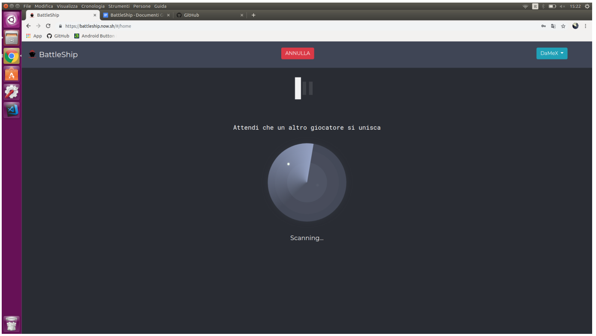
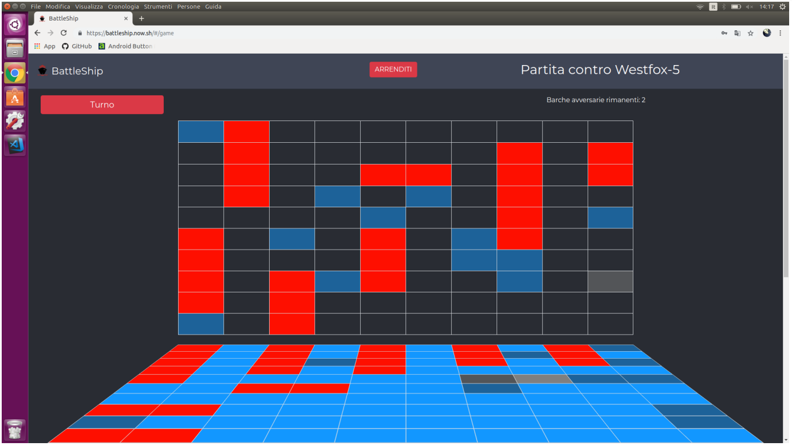
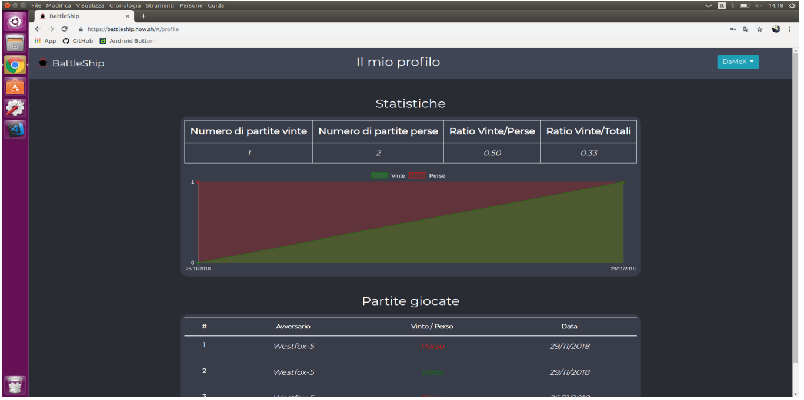
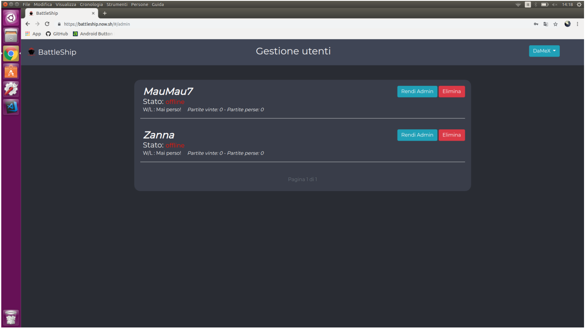
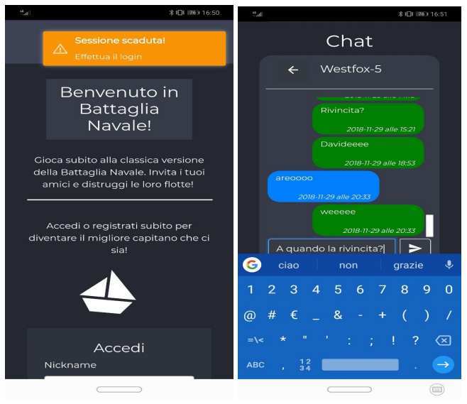
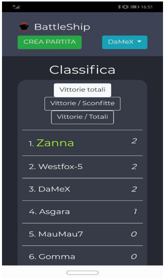

# BattleShip

Project for [Web technologies and applications][taw] course. This project has been done by:

- Dametto Alex
- Volpe Davide
- Zanatta Filippo

This repository is a copy of [Westfox-5](https://github.com/westfox-5/BattleShip) original repository.

## Introduction

This project consists in a multiplayer version of the classic game _BattleShip_.

~~The game is available to play at: xxxxx.~~ Edit: our deployment has been removed for inactivity. The previous URL is not valid anymore.

## Screenshots

Here you can see some screenshots of the application.
We have the login and registration page.



This is the HomePage after logging in:



As you can see on the left we have different type of leaderboard, on the right we have a chat and in the middle we can participate to a game.

Then we have the page where we are searching for an opponent:



When we have found an opponent, we are ready to play.



After placing the boards, we have this page where we can see the opponent boards (in front of us), and then our board on the bottom of the page. As you can see, if we hit a boat we will see gray, red it's a generic boat and blue it's the sea. Below the board we have the chat where we can talk with the opponent.

We have also implemented a profile page where an user can see it's statistics



Also, for admin users, we have a section where we can manage users.



We have also generated an APK from the Angular code using Apache Cordova. This are some results




## Get Started

This guide lets you install the game and play with your local server. This means you can only play with other users connected to your server. You cannot see real time changes (like new games added from other players).

    cd ~/Desktop
    git clone https://github.com/westfox-5/BattleShip
    cd BattleShip

---

#### Install all dependencies

    npm run install

Or choose what to install

    npm run install-server
    npm run install-web
    npm run install-desktop
    npm run install-android

---

#### Start the local Database

    npm run start-db

#### Start the server

    npm run start-server

Server runs at [localhost:8080][s]

---

#### Build & Execute clients

Choose what to execute

- Web: [localhost:4200][c]

        npm run start-web

- Desktop:

        npm run build-desktop
        npm run start-desktop
        npm run generate-desktop :: generete an executable file in `releases/desktop` folder.

- Android:
  npm run build-android
  npm run generate-android :: generate an APK file in `releases/android` folder.

[taw]: http://www.dsi.unive.it/~bergamasco/webtech.html
[s]: localhost:8080
[c]: localhost:4200

## Docker

Before runnig the stack using docker, you have to create a .env file in the root of the project. The .env file should have this structure:

    # DB
    DB_USERNAME=<db_username>
    DB_PASSWORD=<db_password>
    DB_NAME=<db_name>

    # BE
    JWT_SECRET=<jwt_secret>
    JWT_EXPIRE=<jwt_expire>
    DEFAULT_ADMIN_USERNAME=<app_admin_username>
    DEFAULT_ADMIN_PASSWORD=<app_admin_password>
    DB_URL=<db_url>

To execute the app using docker use:

```sh
docker-compose up --build
```
